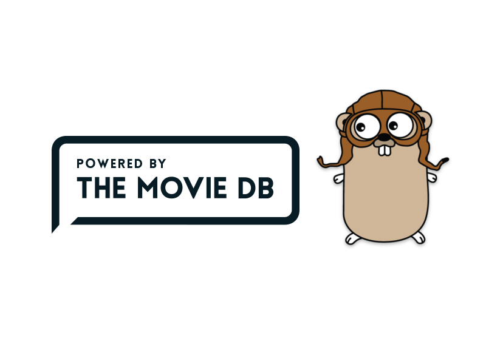

<p align="center"></p>

[](https://travis-ci.org/cyruzin/golang-tmdb) [](https://ci.appveyor.com/project/cyruzin/golang-tmdb) [](https://coveralls.io/github/cyruzin/golang-tmdb?branch=master) [](https://goreportcard.com/report/github.com/cyruzin/golang-tmdb) [](https://godoc.org/github.com/cyruzin/golang-tmdb) [](https://github.com/Naereen/StrapDown.js/blob/master/LICENSE)

This is a Golang wrapper for working with TMDb API. It aims to support version 3. 

An API Key is required. To register for one, head over to [themoviedb.org](https://www.themoviedb.org/settings/api).

This product uses the TMDb API but is not endorsed or certified by TMDb.

## Requirements

- Go 1.11.x or higher. We aim to support the latest supported versions of go.

## Installation

```sh
go get -u github.com/cyruzin/golang-tmdb
```
## Usage

To get started, import the `tmdb` package and initiate the client:

```go
import "github.com/cyruzin/golang-tmdb"

tmdbClient, err := tmdb.Init("YOUR_APIKEY")

if err != nil {
    fmt.Println(err)
}

// OPTIONAL: Setting a custom config for the http.Client.
// The default timeout is 10 seconds. Here you can set other
// options like Timeout and Transport.
customClient := http.Client{
    Timeout: time.Second * 5,
    Transport: &http.Transport{
        MaxIdleConns: 10,
        IdleConnTimeout: 15 * time.Second,
    }
}
tmdbClient.SetClientConfig(customClient)

// OPTIONAL: Enable this option if you're going to use endpoints
// that needs session id.
// 
// You can read more about how this works:
// https://developers.themoviedb.org/3/authentication/how-do-i-generate-a-session-id
tmdbClient.SetSessionID("YOUR_SESSION_ID")

// OPTIONAL (Recommended): Enabling auto retry functionality.
// This option will retry if the previous request fail.
tmdbClient.SetClientAutoRetry()

// OPTIONAL (Recommended): Enabling requests with context.
tmdbClient.SetClientWithContext()

movie, err := tmdbClient.GetMovieDetails(297802, nil)
```

With optional params:

```go
options := make(map[string]string)
options["language"] = "pt-BR"
options["append_to_response"] = "credits,images"
movie, err := tmdbClient.GetMovieDetails(297802, options)
```

For more examples, [click here](https://github.com/cyruzin/golang-tmdb/tree/master/examples).

## Contributing

To start contributing, please check [CONTRIBUTING](https://github.com/cyruzin/golang-tmdb/blob/master/CONTRIBUTING.md).

### Tests

For local testing, create a environment variable called "APIKey" and enter your TMDb key. Check the "tmdb_test.go" file for more details.

## License

MIT
